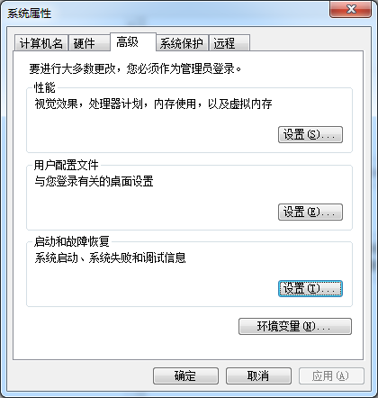
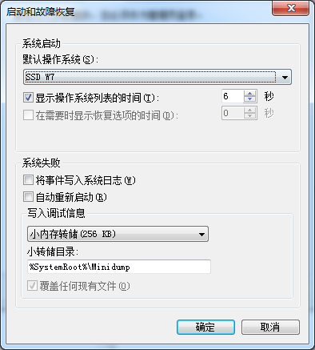

## 迁移笔记

#### 硬盘迁移ssd使用的命令

>修改启动时是系统引导名称

	BCDEdit /set {current} description "SSD W7"

>设置默认引导系统

	控制面板\系统和安全\系统  ->高级系统设置
	

	系统属性  -> 高级  -> 启动故障和恢复\设置

>修改盘符

	打开注册表： regedit
	HKEY_LOCAL_MACHINE\SYSTEM\MountedDevices
	找到对应盘符，右击修改，重启即可

>修复网络

	netsh winsock reset

